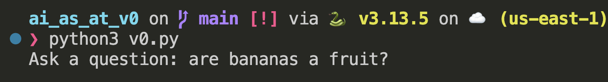

# Aritificial Intelligence as Assistive Tech

## Setup Instructions

Install dependencies:

```
pip install openai tiktoken numpy os dotenv
```

## Create/Attach your OpenAI API Key

Create a `.env` file and add your API key to the file like this:

```
OPENAI_API_KEY="enter your key here"
```

## Run the file

Now, run your code:

```
python3 v0.py
```

And you should see:

